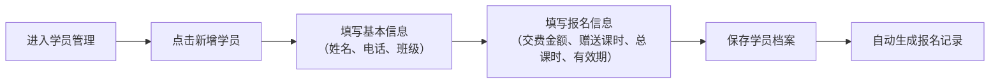
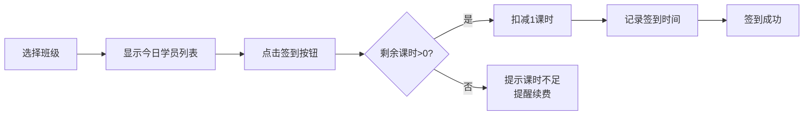
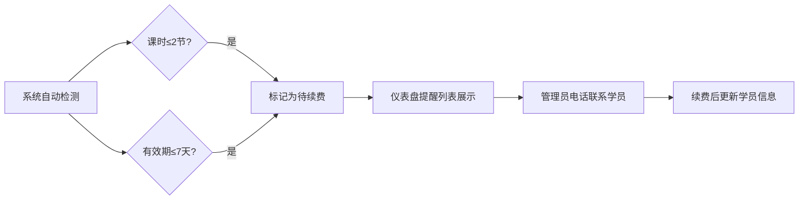

# 舞蹈工作室学员管理系统 PRD

## 1. 产品概述

专为小型舞蹈工作室设计的学员课时与签到管理工具，解决手工记账混乱、课时统计繁琐、续费提醒不及时等问题。帮助工作室高效管理学员报名、课时扣减、签到考勤、续费提醒及数据统计导出。

### 目标用户
- 舞蹈工作室老板/管理者
- 舞蹈老师（签到操作）

### 核心价值
- 课时管理自动化，避免人工计算错误
- 续费提醒智能化，减少学员流失
- 出勤率数据化，辅助教学决策

---

## 2. 核心功能

### 2.1 用户角色

| 角色 | 登录方式 | 核心权限 |
|------|----------|----------|
| 管理员 | 无需登录（本地工具） | 全部功能：学员管理、签到、统计、导出、设置 |

> 说明：本系统为本地单机工具，无需多账号登录，数据存储在浏览器本地。

### 2.2 功能模块

1. **仪表盘首页**：数据概览、续费提醒、快速签到入口
2. **学员管理**：学员列表、新增/编辑/删除学员、报名记录
3. **签到管理**：按班级签到、签到历史、请假/补签
4. **班级统计**：各班级出勤率、课时消耗统计
5. **数据导出**：月底导出学员剩余/已上课时数据

### 2.3 页面详情

| 页面名称 | 模块名称 | 功能描述 |
|----------|----------|----------|
| 仪表盘 | 数据概览卡片 | 总学员数、本月签到人次、待续费学员数、今日上课班级 |
| 仪表盘 | 续费提醒列表 | 显示课时≤2节或有效期≤7天的学员，标记紧急程度 |
| 仪表盘 | 快速签到 | 选择班级后一键进入签到界面 |
| 学员管理 | 学员列表 | 按班级/姓名筛选，显示姓名、班级、剩余课时、有效期、状态 |
| 学员管理 | 新增/编辑学员 | 填写姓名、电话、班级、交费金额、赠送课时、总课时、有效期 |
| 学员管理 | 学员详情 | 查看报名记录、签到历史、课时变动明细 |
| 签到管理 | 班级签到 | 显示班级学员列表，点击签到/取消签到，实时扣减课时 |
| 签到管理 | 签到记录 | 按日期查看历史签到记录，支持补签和请假标记 |
| 班级统计 | 出勤率排行 | 各班级出勤率对比柱状图，标记低出勤率班级 |
| 班级统计 | 课时消耗趋势 | 近30天每日课时消耗折线图 |
| 数据导出 | 导出报表 | 选择月份，导出 Excel/CSV 格式的学员课时统计表 |

---

## 3. 核心流程

### 3.1 学员报名流程

### 3.2 上课签到流程

### 3.3 续费提醒流程

---

## 4. 用户界面设计

### 4.1 设计风格

**整体风格**：现代简洁 + 柔和优雅，体现舞蹈艺术的美感

- **主色调**：深玫瑰色 `#be185d` —— 热情、活力，符合舞蹈行业特质
- **辅助色**：暖金色 `#f59e0b` —— 提醒、高亮
- **中性色**：米白 `#fdf2f8` 背景、深灰 `#1f2937` 文字
- **按钮风格**：圆角胶囊按钮，柔和阴影，悬停微放大
- **字体**：标题使用「思源黑体 Bold」，正文使用「思源黑体 Regular」
- **布局风格**：卡片式布局，顶部导航栏 + 侧边菜单
- **图标风格**：线性图标（Lucide），统一 20px 尺寸

### 4.2 页面设计概览

| 页面名称 | 模块名称 | UI 元素 |
|----------|----------|---------|
| 仪表盘 | 数据卡片 | 渐变背景卡片，大数字展示，图标装饰 |
| 仪表盘 | 续费提醒 | 红色/黄色标签区分紧急程度，电话图标 |
| 学员列表 | 表格 | 斑马纹行，状态标签，操作按钮组 |
| 签到页面 | 学员卡片 | 头像 + 姓名 + 剩余课时，签到按钮大而醒目 |
| 统计页面 | 图表 | 柱状图 + 折线图，渐变色填充 |

### 4.3 响应式

- **设计优先**：桌面端优先（工作室管理主要在电脑上操作）
- **移动端适配**：支持平板横屏查看，签到页面优化触控操作
- **断点**：1024px（平板）、768px（手机）

---
