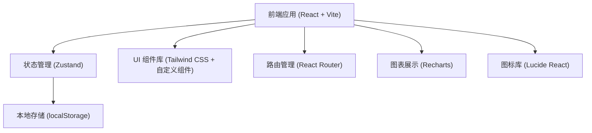

# 舞蹈工作室学员管理系统 - 技术架构

## 1. 架构设计



> 说明：本系统为纯前端单页应用，数据存储在浏览器 localStorage 中，无需后端服务。

---

## 2. 技术说明

| 层级 | 技术选型 | 版本 | 说明 |
|------|----------|------|------|
| 前端框架 | React | 18.x | 组件化开发 |
| 构建工具 | Vite | 5.x | 快速开发构建 |
| 编程语言 | TypeScript | 5.x | 类型安全 |
| CSS 框架 | Tailwind CSS | 3.x | 原子化 CSS |
| 状态管理 | Zustand | 4.x | 轻量级状态管理 |
| 路由 | React Router DOM | 6.x | 单页路由 |
| 图标 | Lucide React | latest | 线性图标库 |
| 图表 | Recharts | latest | React 图表库 |
| 数据存储 | localStorage | - | 浏览器本地存储 |

---

## 3. 路由定义

| 路由路径 | 页面名称 | 说明 |
|----------|----------|------|
| `/` | 仪表盘 | 数据概览、续费提醒、快速签到 |
| `/students` | 学员管理 | 学员列表、新增/编辑学员 |
| `/students/:id` | 学员详情 | 学员信息、报名记录、签到历史 |
| `/checkin` | 签到管理 | 班级选择、学员签到 |
| `/statistics` | 班级统计 | 出勤率、课时消耗统计 |
| `/export` | 数据导出 | 报表导出 |

---

## 4. 数据模型

### 4.1 数据模型 ER 图

```mermaid
erDiagram
    STUDENT ||--o{ ENROLLMENT : has
    STUDENT ||--o{ CHECKIN : has
    CLASS ||--o{ STUDENT : has
    
    STUDENT {
        string id "学员ID"
        string name "姓名"
        string phone "电话"
        string classId "所属班级ID"
        number totalLessons "总课时"
        number remainingLessons "剩余课时"
        number paidAmount "交费金额"
        number giftedLessons "赠送课时"
        string enrollDate "报名日期"
        string expireDate "有效期截止"
        string status "状态：active/inactive"
        string createdAt "创建时间"
        string updatedAt "更新时间"
    }
    
    CLASS {
        string id "班级ID"
        string name "班级名称"
        string description "班级描述"
        string color "主题色"
    }
    
    CHECKIN {
        string id "签到ID"
        string studentId "学员ID"
        string classId "班级ID"
        string date "签到日期"
        string checkinTime "签到时间"
        string type "类型：normal/makeup/leave"
        string note "备注"
    }
    
    ENROLLMENT {
        string id "报名记录ID"
        string studentId "学员ID"
        number paidAmount "交费金额"
        number totalLessons "总课时（含赠送）"
        number giftedLessons "赠送课时"
        string enrollDate "报名日期"
        string expireDate "有效期"
        string note "备注"
    }
```

### 4.2 初始数据

系统预置 3 个默认班级：
- 街舞班
- 拉丁班
- 幼儿班

---

## 5. 目录结构

```
src/
├── components/          # 公共组件
│   ├── Layout/         # 布局组件
│   ├── Card/           # 卡片组件
│   ├── Modal/          # 弹窗组件
│   └── Table/          # 表格组件
├── pages/              # 页面组件
│   ├── Dashboard/      # 仪表盘
│   ├── Students/       # 学员管理
│   ├── Checkin/        # 签到管理
│   ├── Statistics/     # 统计分析
│   └── Export/         # 数据导出
├── store/              # 状态管理 (Zustand)
│   ├── useStudentStore.ts
│   ├── useClassStore.ts
│   └── useCheckinStore.ts
├── types/              # TypeScript 类型定义
│   └── index.ts
├── utils/              # 工具函数
│   ├── storage.ts      # localStorage 封装
│   ├── date.ts         # 日期处理
│   └── export.ts       # 导出功能
├── App.tsx             # 根组件
├── main.tsx            # 入口文件
└── index.css           # 全局样式
```

---

## 6. 核心功能实现思路

### 6.1 数据持久化
- 使用 Zustand + localStorage 中间件
- 所有状态变更自动同步到 localStorage
- 页面加载时从 localStorage 恢复数据

### 6.2 课时扣减逻辑
- 签到时检查剩余课时 > 0
- 正常签到：remainingLessons - 1
- 请假：不扣课时，标记 type=leave
- 补签：从赠送课时优先扣除，再扣正常课时

### 6.3 续费提醒判断
- 剩余课时 ≤ 2 节 → 提醒
- 有效期 ≤ 7 天 → 提醒
- 两个条件都满足 → 紧急提醒（红色标记）

### 6.4 出勤率计算
- 出勤率 = 实际签到次数 / 应到次数 × 100%
- 应到次数 = 统计周期内上课天数
- 请假不计入缺勤

### 6.5 数据导出
- 支持 CSV 格式导出
- 可选择导出月份
- 导出字段：姓名、班级、总课时、已上课时、剩余课时、有效期
